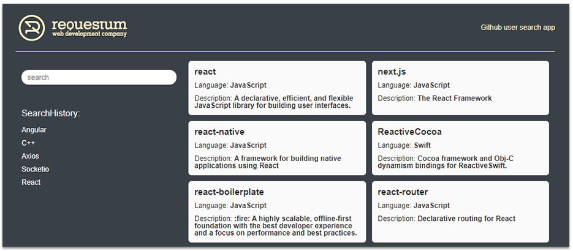

# Github search app (teast task)

This project was bootstrapped with [Create React App](https://github.com/facebook/create-react-app).

## How to use

- Сlone or download archive to working folder
- Install npm packages specified in package.json file:

#### `npm install`

- Run to view:

#### `npm start`

- Run in the development mode:

#### `npm run dev`

In developer mode, an additional sass-compiler will be launched. It will track your `.sass` file save and make an
automatic compilation

### Technical stacks and libraries used in the development

[React](https://www.npmjs.com/package/react), [Redux](https://www.npmjs.com/package/redux),
[Axios](https://www.npmjs.com/package/axios), [Sass](https://www.npmjs.com/package/node-sass)
